#### Redis

### 压力测试工具

redis-benchmark 是一个压力测试工具

### 基本知识

1.默认16的数据库，切换数据库select，查看数据库dbsize

2.清空数据库 flushalll,flushdb

3.Redis单线程，很快地，基于内存操作，CPU不是Redis性能瓶颈，Redis的瓶颈是根据机器的内存和网络带宽，既然可以使用单线程来实现，就使用单线程了。

Redis是C语言写的，Redis单线程

Redis为什么单线程这么快？

1、误区：高性能的服务器一定是多线程的；多线程（CPU上下文切换！）一定比单线程效率高

核心：Redis是将所有的数据全部放在内存中的，所以说使用单线程去操作效率是最高的，

incrby/decrby/

都是在一个CPU上面的，在内存情况下，这个最佳

### 五大数据类型

### Redis-key

keys  *

Expire name 10

set name 10

type:查看类型

### String字符串

截取：GETRANGE

替换：SETRANGE

设置过期时间：setex(set with expire)

不存在则设置(在分布式锁会常使用)：setnx(set if not exist)

批量设置值：mset，mget，msetnx(原子性操作，要么一起成功，要么一起失败)

set user:1{name:zhangsan,age:3}  #设置一个user:1 对象值为json字符来保存一个对象！

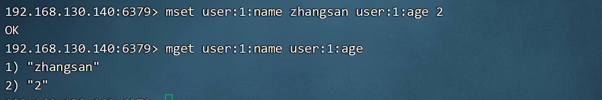

getset:如果存在值，获取原来的值，并设置新的值

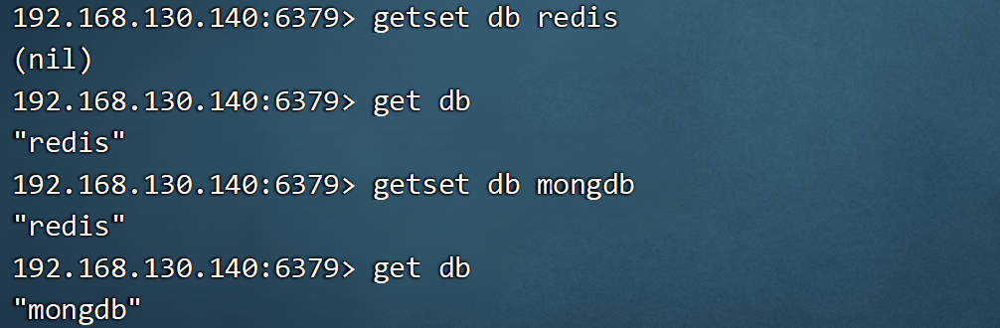

String使用场景：value除了是我们的字符串还可以是我们的数字

* 计数器
* 统计多单位的数量 uid:95454:follow 0
* 粉丝数
* 对象缓存存储

## List

在redis里面

Lpush

Rpush

Lpop

Rpop

LRANGE list 0 -1

Lindex list 1：获取指定下标的值

Llen list #返回列表的长度


#############################################################

移除指定的值

EXISTS list  :判断这个列表是否存在

lrem list 1 one:移除list指定的值

ltrim:通过下标截取指定长度，这个list已经改变了，截断了只剩下截取的元素

rpoplpush:移除列表的最后一个元素，将它移动到新的列表中

lset ;将列表中指定小标的值替换为另外一个值，更新操作，如果不存在列表我们去更新就会报错

linsert ：在某个具体的value插入到指定元素的前面或者后面！

小结

* 他实际上是一个链表，
* 如果移除了所有值，空链表，也代表不存在
* 在两边插入或者改动值，效率最高，！中间元素，相对来说，效率第一点
* 可当做栈或者是队列

### Set集合

192.168.130.140:6379> sadd myset lovekaungshen2
(integer) 0
192.168.130.140:6379> smembers myset 
1) "kuangshen"
2) "lovekaungshen"
3) "lovekaungshen2"
4) "lovekuangshen"
5) "kaungshen"
6) "hello"
192.168.130.140:6379> srem myset lovekaungshen\
(integer) 0
192.168.130.140:6379> srem myset lovekaungshen#移除
(integer) 1
192.168.130.140:6379> scard myset#看set个数
(integer) 5

192.168.130.140:6379> srandmember myset#随机抽选出一个数
"kaungshen"

192.168.130.140:6379> srandmember myset 2#随机抽选出两个数
1) "lovekuangshen"
2) "hello"

############################################

删除指定的key,随机删除key

192.168.130.140:6379> smove myset myset2 kuangshen#从一个集合移动到另一个集合
(integer) 1

############################################

微博，B站，共同关注（并集）

数字集合类：

-差集

-交集

-并集

192.168.130.140:6379> sdiff key1 key2#差集
1) "b"
2) "a"
192.168.130.140:6379> sinter key1 key2#交集，共同好友可以这样实现
1) "c"
192.168.130.140:6379> sunion key1 key2#并集
1) "a"
2) "c"
3) "e"
4) "d"
5) "b"

微博，A用户将所有关注的人放在一个set集合中，将它的粉丝放在一个集合中，共同关注，共同爱好，二度好友，推荐好友

###############################################

Hash（哈希）

Map集合，

192.168.130.140:6379> hmset myhash field1 hello field2 world
OK
192.168.130.140:6379> hmget myhash field1 field2
1) "hello"
2) "world"
192.168.130.140:6379> hgetall myhash
1) "field1"
2) "hello"
3) "field2"
4) "world"
192.168.130.140:6379> hdel myhash field1
(integer) 1
192.168.130.140:6379> hgetall myhash
1) "field2"
2) "world"

192.168.130.140:6379> hlen myhash#获取哈希表的字段数量
(integer) 2

192.168.130.140:6379> hexists myhash field1#判断hash中指定字段是否存在
(integer) 1

###############################################

#只获得所有field

#只获得所有value

192.168.130.140:6379> hkeys myhash#只获得所有field
1) "field2"
2) "field1"
192.168.130.140:6379> hvals myhash#只获得所有value
1) "world"
2) "hello"

###############################################

incr   decr

192.168.130.140:6379> hincrby myhash field3 2#指定增量
(integer) 3
192.168.130.140:6379> hincrby myhash field3 -1
(integer) 2
192.168.130.140:6379> hsetnx myhash field4 hello#如果不存在，则可以设置
(integer) 1
192.168.130.140:6379> hsetnx myhash field4 world#如果存在，则不能设置
(integer) 0

哈希的应用

变更的数据，尤其是用户的信息，经常变动的信息！hash更适合于对象的存储,string更适合字符串存储

###############################################

Zset(有序集合sorted set)

在set的基础上，增加了一个值，set k1 v1     zset k1 score1 v1 

192.168.130.140:6379> zadd myset 1 one#添加一个值
(integer) 1
192.168.130.140:6379> zadd myset 2 two 3 three#添加多个值
(integer) 2
192.168.130.140:6379> zrange myset 0 -1
1) "one"
2) "two"
3) "three"

##############################################

192.168.130.140:6379> zadd salary 2500 xiaohong  #添加三个用户
(integer) 1
192.168.130.140:6379> zadd salary 5000 zhangsan
(integer) 1
192.168.130.140:6379> zadd salary 500 zhangsan
(integer) 0
192.168.130.140:6379> zadd salary 500 kungshen
(integer) 1
192.168.130.140:6379> zrangebyscore salary -inf +inf  #显示全部的用户，从小到大！
1) "kungshen"
2) "zhangsan"
3) "xiaohong"

192.168.130.140:6379> zrevrange salary 0 -1  #从大到小进行排序
1) "zhangsan"
2) "kungshen"

192.168.130.140:6379> zrangebyscore salary -inf +inf withscores  #显示全部的消息带上分数成绩
1) "kungshen"
2) "500"
3) "zhangsan"
4) "500"
5) "xiaohong"
6) "2500"
192.168.130.140:6379> zrangebyscore salary -inf 2500 withscores显示工资小于2500的升序排列
1) "kungshen"
2) "500"
3) "zhangsan"
4) "500"
5) "xiaohong"
6) "2500"

###############################################

#移除rem中的元素

192.168.130.140:6379> zrange salary 0 -1
1) "kungshen"
2) "zhangsan"
3) "xiaohong"
192.168.130.140:6379> zrem salary xiaohong  # 移除有序集合中的指定元素
(integer) 1
192.168.130.140:6379> zrange salary 0 -1
1) "kungshen"
2) "zhangsan"

192.168.130.140:6379> zcard salary  #获取有序集合中的个数
(integer) 2


###############################################

192.168.130.140:6379> zadd myset 1 hello
(integer) 1
192.168.130.140:6379> zadd myset 2 world 3 kuangshen
(integer) 2
192.168.130.140:6379> zcount myset 1 3  #获取指定区间的成员数量
(integer) 3
192.168.130.140:6379> zcount myset 1 2  #
(integer) 2

其余的很多API，通过我们的学习，自己官网

set排序，存储班级成绩表，工资表排序

普通消息1，重要消息，带权重进行判断

排行榜应用实现，取Top N测试

###############################################

### 事务

Redis事务本质：一组命令的集合，一个事务中的所有命令都会被序列化，在事务执行过程中的，会按照顺序执行

一次性，顺序性，排他性，执行一系列的命令

redis事务没有隔离级别的概念

所有的命令在事务中，并没有直接被执行，只有发起执行命令的时候才会被执行

Redis单条命令是保存原子性的，但是事务不保证原子性

redis的事务(正常执行事务、放弃事务（discard）)：

* 开启事务（Multi）
* 命令入队（~~~）
* 执行事务（exec）

编译型异常（代码有问题）：事务中所有命令都不会被执行

运行时异常（1/0）：如果事务中存在语法性，那么执行命令的时候，其他命令都是可以正常执行的。错误命令抛出异常~


### 监控（Watch，面试常问）

### 悲观锁

### 乐观锁：

更新数据的时候去判断一下，在此期间是否有人修改过这个数据

获取version,更新的时候比较version

测试多线程修改至，使用watch可以当做乐观锁（unwatch）

如果事务执行失败，就先解锁

2.获取最新的值，再此监视

3.比对监视的值是否发生了变化，如果没有变化，那么可以执行成功，如果变了就执行失败

### Jedis

java操作redis,指令就是几种数据类型的方法

1.连接数据库

2.操作命令

3.结束命令

常用数据类型（API）

String,List,Set,Hash,Zset

##                                                           SpringBoot整合Redis

SpringBoot和SpringData齐名

jedis:采用的直连，多个线程操作的话，是不安全的，如果想要避免不安全的，使用jedis pool连接池！更像BIO模式

lettuce:采用netty,实例可以用多个线程进行分享，不存在线程不安全的情况，更像

##SpringBoot 所有的配置类，都有一个自动配置类；自动配置类都会绑定一个properties

//在真实的开发中，一般都可以看到一个公司自己封装的RedisUtile工具

所有的redis操作，理解redis的思想和数据结构的使用

```java
   @Bean
    @ConditionalOnMissingBean(name = {"redisTemplate"})
    public RedisTemplate<Object, Object> redisTemplate(RedisConnectionFactory redisConnectionFactory) throws UnknownHostException {
        //默认的RedisTemplate没有过多的设置，redis对象都是需要序列化
        //两个泛型都是Object,Object的类型，我们需要强制转换<String,Object>
       
        RedisTemplate<Object, Object> template = new RedisTemplate();
        template.setConnectionFactory(redisConnectionFactory);
        return template;
    }

    @Bean
    @ConditionalOnMissingBean
//由于String是redis中最常使用的类型，所以单独提出来一个bean
    public StringRedisTemplate stringRedisTemplate(RedisConnectionFactory redisConnectionFactory) throws UnknownHostException {
        StringRedisTemplate template = new StringRedisTemplate();
        template.setConnectionFactory(redisConnectionFactory);
        return template;
    }
```

```
//在企业开发中，我们80%的情况下，都不会使用原生的方式去编写代码，使用RedisUtil
redisTemplate.opsForValue //操作字符串，类似String
redisTemplate.opsForList //
redisTemplate.opsForSet
redisTemplate.opsForHash
redisTemplate.opsForZset
```


除了基本的操作，我们常用的方法都可以直接通过redisTemplate操作，比如事务和基本的crud

//在企业开发中，我们所有的pojo都会序列化，SpringBoot+Dubbo+Zookepper

```
@Configuration
@EnableCaching
public class RedisConfig extends CachingConfigurerSupport {
  @Bean
  @SuppressWarnings(value = {"unchecked", "rawtypes"})
  public RedisTemplate<Object, Object> redisTemplate(RedisConnectionFactory connectionFactory) {
    RedisTemplate<Object, Object> template = new RedisTemplate<>();
    template.setConnectionFactory(connectionFactory);
//Json序列化配置
    FastJson2JsonRedisSerializer serializer = new FastJson2JsonRedisSerializer(Object.class);
    ObjectMapper mapper = new ObjectMapper();
    mapper.setVisibility(PropertyAccessor.ALL, JsonAutoDetect.Visibility.ANY);
    mapper.activateDefaultTyping(
        LaissezFaireSubTypeValidator.instance,
        ObjectMapper.DefaultTyping.NON_FINAL,
        JsonTypeInfo.As.PROPERTY);
    serializer.setObjectMapper(mapper);
    template.setValueSerializer(serializer);
    // 使用StringRedisSerializer来序列化和反序列化redis的key值
    template.setKeySerializer(new StringRedisSerializer());
    template.afterPropertiesSet();
    return template;
  }
}
```

Redis配置文件

启动的时候，就通过配置文件来启动

* 配置文件，unit单位对大小写不敏感

* 包含其他文件，include

* 网络

  ```
  bind 127.0.0.0.1 //绑定的ip
  protected-mode yes //保护模式
  port 6379 //端口设置
  ```

* 通用General


* 快照

  持久化，在规定的时间内，执行了多少次操作，则会持久化到文件    .rdb.aof

redis是内存数据库，如果没有持久化，那么数据丢失

```
# 如果900s内，如果至少有一个key进行了修改，我们及时进行持久化操作
save 900 1
save 300 10
save 60 10000
stop-writers-on-bgsave-error yes #持久化如果出错，是否还需要继续工作
rdbcompression yes #是否压缩rdb文件，需要消耗一些cpu资源
rdbchecksum yes  # 保存rdb文件的时候，进行错误的检查检验
dir ./ # rdb文件保存的目录
```

* Replication：主从复制

* Security

  ```
  
  requirepass:密码设置
  ```

* 限制CLIENTS

  maxclients 10000 #设置能连接上redis的最大客户端的数量

  maxmemory <bytes>#redis配置最大的内存容量

  maxmemory-policy #内存到达上限之后 的处理策略

* APPEND ONLY 模式 aof配置，默认关闭的，默认是使用rdb方式持久化的

  

### Redis持久化（Redis DataBase）

rdb保存的文件是 dump.rdb

Redis是内存数据库，如果不将内存中的数据库状态保存到磁盘，那么一旦服务器进程退出，服务器中的数据库状态也会消失，所以Redis提供了持久化功能

触发机制

1.save的规则满足的情况下，会自动出发rdb规则

2.执行flushall清空命令，也会触发我们的rdb规则

3.退出redis,也会产生rdb文件！

如何恢复rdb文件

1.只需要将rdb文件放在redis启动目录就可以了，redis就会检查备份

2.查看需要存放的位置：config get dir

1)"dir"

2)"/usr/local/bin"    #如果在这个目录下存在dump.rdb文件，启动就会自动恢复其中的数据

原理

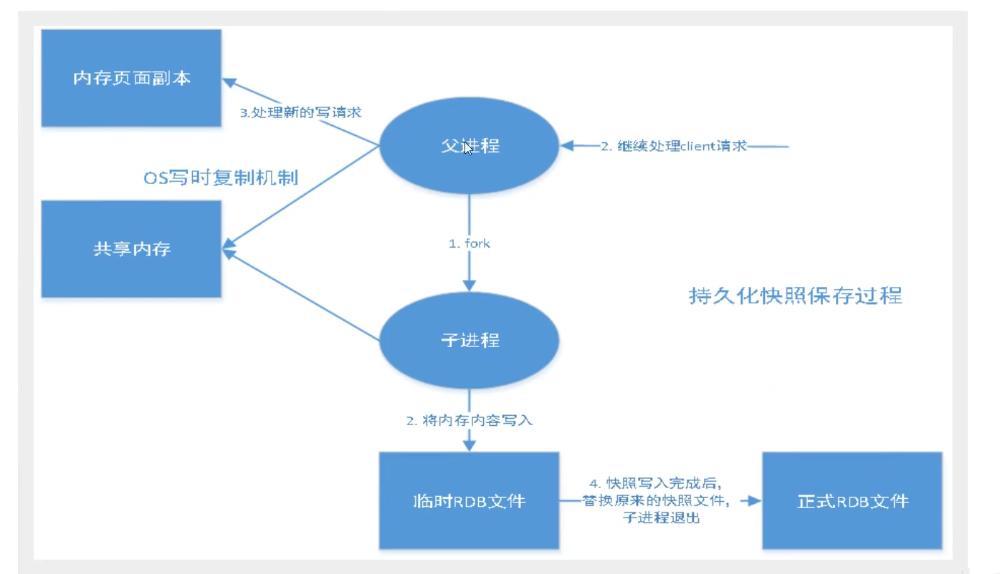

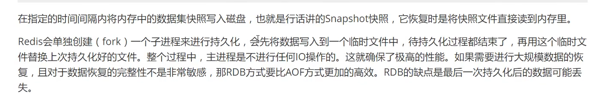

优点：

1.适合大规模的数据恢复！dump.rdb

2.如果对数据完整性要求不高

缺点：

1.需要一定的时间间隔进程操作，如果redis意外宕机了，这个最后一次修改数据就没有了

2.fork进程的时候，会占用一定的内容空间

AOF(Append Only File)

将我们的所有命令都记录下来，history,恢复的时候就把这些文件都执行一遍，生成文件appendonly.aof（记录我们所有的写操作）

默认是不开启的，我们需要手动进行配置！我们只需要将appendonly改为yes就开启了aof！重启，redis就可以生效了

如果这个aof文件有错位，这时候redis是启动不起来，我们需要修复这个aof文件，redis给我们提供了一个工具 redis-check-aof;命令是redis-check-aof --fix appendonly.aof

原理

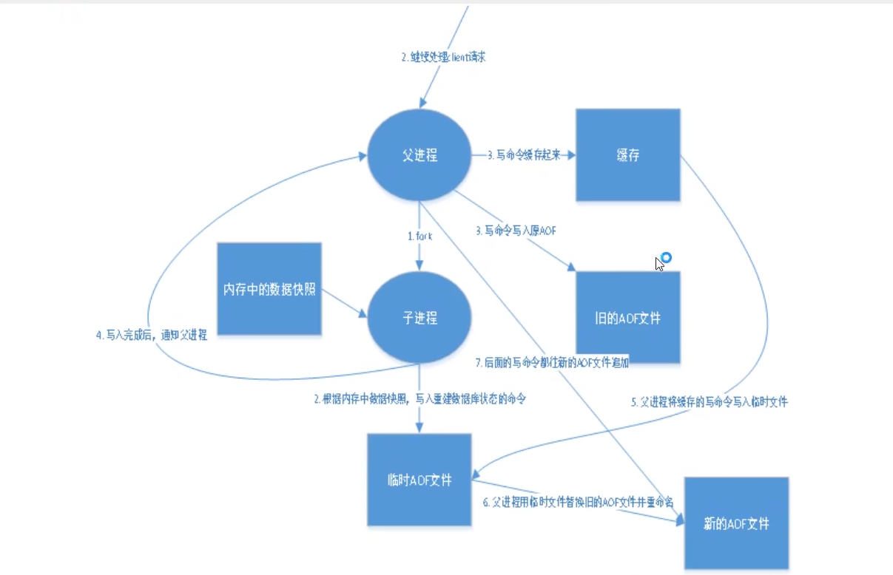


优点：

1.每一次修改都同步，文件的完整性会更加好

2.每秒同步一次，可能会丢失一秒的数据

3.从不同步，效率最高的！

缺点：

1.相对于数据文件来说，aof远远大于rdb,修复的速度比rdb慢

2.AOF运行效率也要比rdb慢，所以我们redis默认的配置就是redis持久化

重写规则说明

aof默认就是文件的无限追加，文件会越来越大，如果aof文件大于64m,太大了，fork一个新的进程来将我们的文件进行重写！

### Redis发布订阅

Redis发布订阅是一种消息通信模式，发送者发送信息，订阅者接收信息

Redis客户端可以订阅任意数量的频道

订阅、发布消息图：

第一个：消息发送者，第二个：频道，第三个：消息订阅者

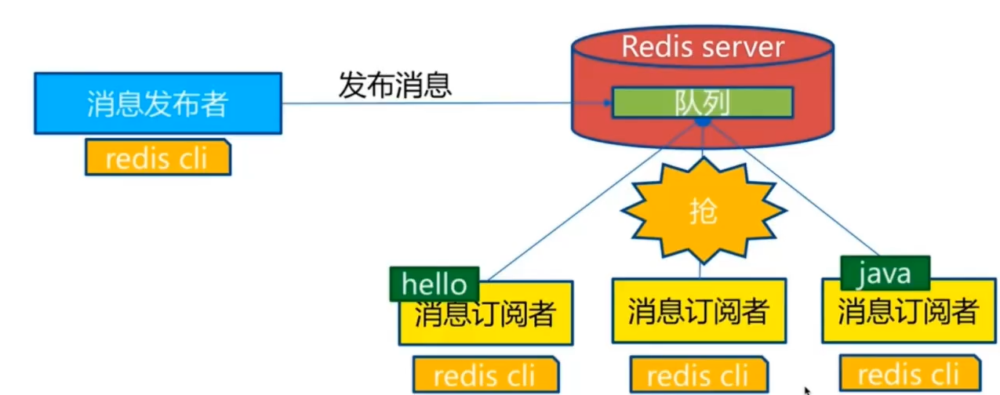

测试

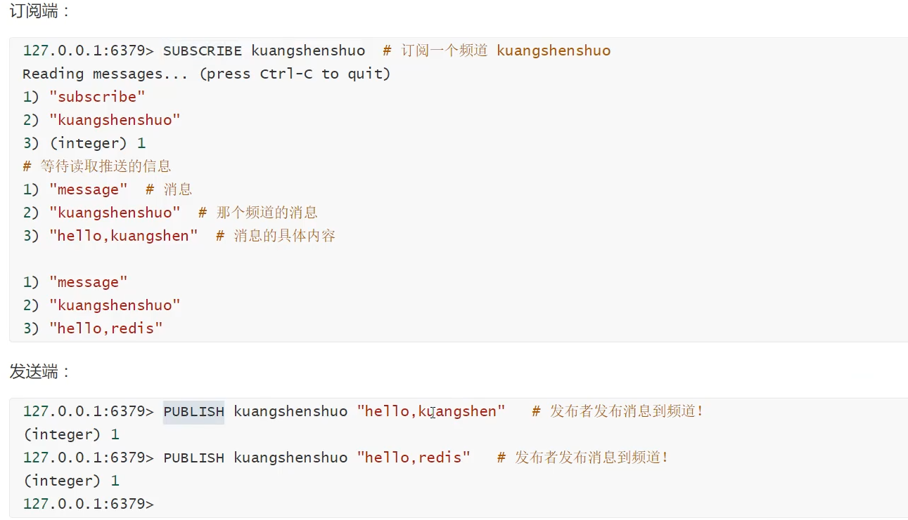

### 原理

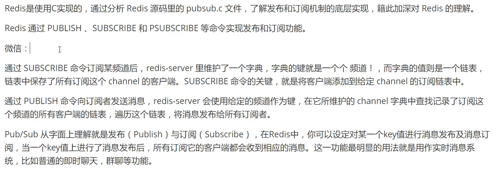

使用场景：

1.实时消息系统

2.实时聊天（频道当做聊天室，将信息回显给所有人即可）

3.订阅，关注系统都是可以的

### Redis主从复制

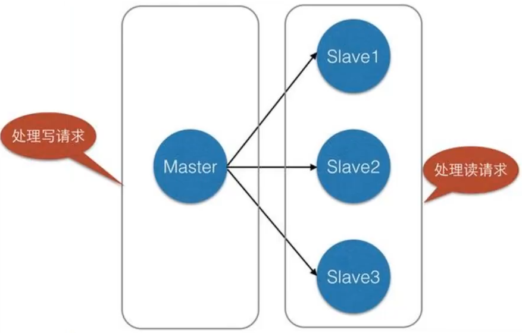

1.主从复制，读写分离，

2.单台Redis最大使用内存不应该超过20G，

3.一般是一主二从

4.数据的复制是单向的，只能由主节点到从节点

默认情况下，每台Redis服务器都是主节点

### 环境配置

只配置从库，不用配置主库

1.复制3个配置文件，修改：端口号、pidfile进程文件、logfiledump.db文件，

2.启动redis:redis-server kconfig/redis80.conf，通过进程信息查看

3.启动redis-cli -p 6380(端口号)

4.配置从机，认老大!命令：SLAVEOF 地址 端口号

真实的从主配置应该是从配置文件里面配置的，这样的话是永久的，我们使用的命令是暂时的

主机可以写，从机不能写只能读，主机中的所有信息和数据，都会自动被从机保存

主机断开连接（SHUTDOWN），从机依旧连接到主机的，但是没有写操作，这个时候，主机如果回来了，从机依旧可以直接获取到主机写的信息

如果使用命令行，来配置的主从，这个时候如果重启了，就会变成主机！只要变成从机，立马就会从主机中获取值~

### 复制原理

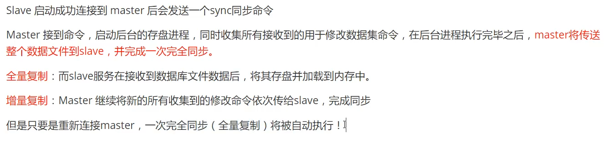

### 层层链路

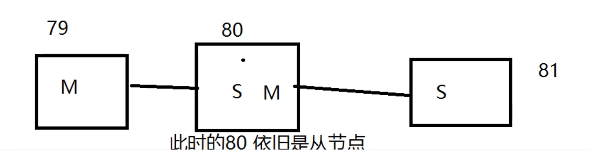

这时候也可以完成我们的主从复制

如果主机断开了连接，我们可以使用命令 ：SLAVE no one 让自己变成主机，其他节点就可以手动连接到最新的主节点。

如果这个时候主机回来了，

### 哨兵模式（自动选举主机的模式）

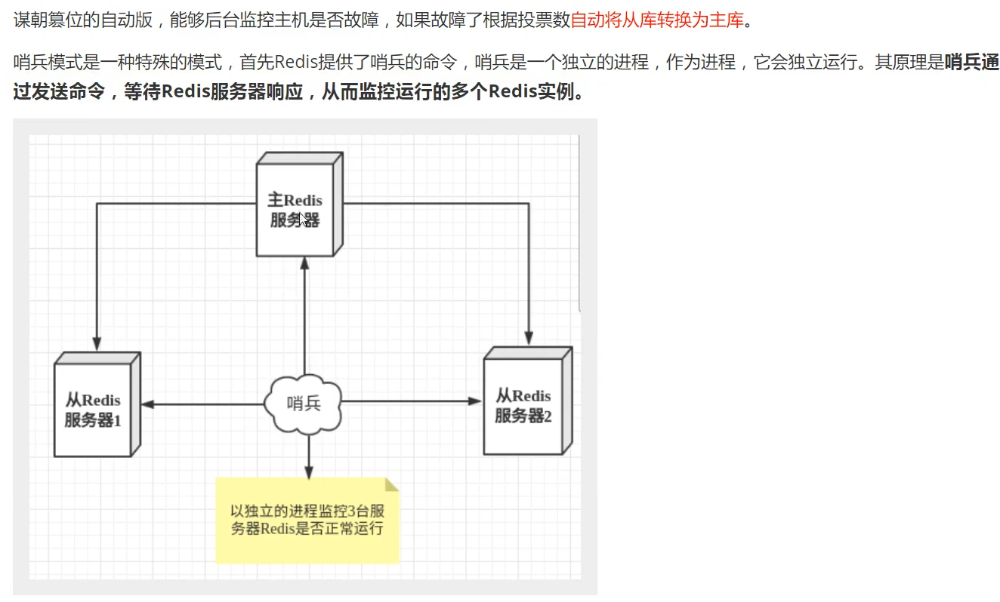

多哨兵模式

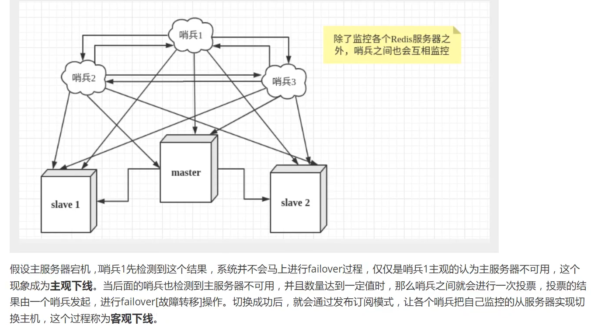

哨兵作用

1.检测主从的状态

2.当主机宕机，通过发布订阅模式，修改配置文件，改变主机

操作

1.配置哨兵配置文件sential.conf

```
#sentinel monitor 被监控的名字 host port 1
sentinel monitor myredis 127.0.0.1 6379 1
#后面的1表示主机挂了，slave投票看让谁接替成为主机，票数最多的，就会成为主机！
```

如果Master节点断开了，这个时候就会从从机中选择随机选择一个服务器（有一个投票算法）

哨兵日志：failover、sdown slave XXX.XXX...XXX@ myredis 127.0.0.1.6381

如果主机回来了，只能归并到新的主机下，当做主机，这是哨兵模式的规则

优点

1.哨兵集群，基于主从复制模式，所有的主从复制优点，他全有

2.主从可以切换，故障可以转移，系统的可用性就会更好

3.哨兵模式就是从手动变成自动

缺点：

1.redis不好在线扩容，集群容量一旦到达上限，就很麻烦

2.实现哨兵模式的配置很麻烦，多选择

### Redis缓存穿透和雪崩（高可用）

### 缓存穿透（查不到）


解决方案：布隆过滤器、缓存空对象

### 缓存击穿（量太大，缓存过期）

微博服务器宕机

解决方案：

1.设置热点数据永不过期

2.加互斥锁

缓存雪崩

缓存雪崩，是指在某一个时间段，缓存集中过期失效。redis宕机

解决方案：

redis高可用

限流降级

数据预热

 


