## Spring

1.优点

* Spring是一个开源的免费的框架
* Spring是一个轻量级的，非入侵式的框架
* 控制反转（IOC），面向切面编程（AOP）
* 支持事务的处理，对框架整合的支持

缺点：配置太多

总结;Spring就是一个轻量级的控制反转（IOC）和面向切面编程（AOP）的框架！

2.Spring七大模块

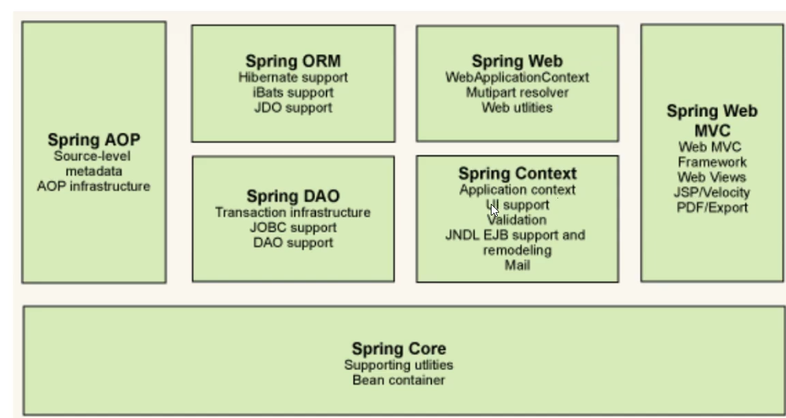

SpringBoot

* 一个快速的脚手架

* 基于SpringBoot可以快速的开发单个微服务

* 约定大于配置

SpringCloud:基于SpringBoot实现

## 控制反转思想，用依赖注入实现

```
private UserDap userDao;
//利用set注入
public void setUserDao(UserDao userDao){
this.userDao=userDao;
}
```

之前程序员是主动创建对象，控制权在程序员手上

使用了set注入后，程序不再具有主动性，而是变成了被动的接收对象，这种思想，这是IOC的原型

对象有Spring创建，管理，装配

控制：谁来控制对象的创建，传统应用程序的对象是由程序本身控制的，使用Spring后，对象是由Spring来创建的

反转:程序本身不创建对象，而变成被动的接收对象

依赖注入：就是利用set方法来进行注入的

IOC是一种变成思想，有主动的编程编程被动的接收

## Spring

### IOC创建对象的方式

1.使用无参构造方式

2.有参构造方式

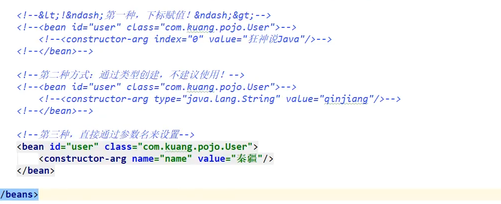

总结：在配置文件加载的时候，容器中管理的对象就已经初始化了！

## Spring配置

1.别名

```
<!--别名，如果添加了别名，我们也可以使用别名获取到这个对象-->
<alias name="user" alias="userNew">
```

2.Bean的配置

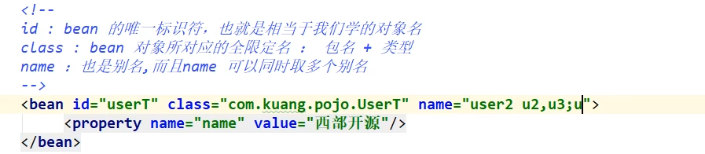

3.import

这个import,一般用于团队开发使用，他可以将多个配置文件，导入合并为一个

假设，项目中有多个人开发，这三个人肤质不同的类开发，不同的类需要注册在不同的bean中，我们可以用import将所有人的bean.xml合并为一个总的！在applicationContext.xml的import，

```
<import resource="beans.xml"/>
<import resource="beans2.xml"/>
<import resource="beans3.xml"/>
```

### 依赖注入

1.构造器注入

2.Set注入

* 依赖注入：Set注入

       * 依赖：bean对象的创建依赖于容器
       * 注入：bean对象中的所有容器，由容器来注入


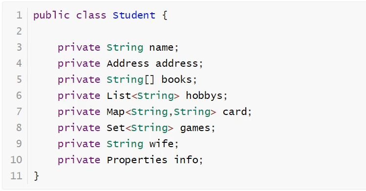

注入：

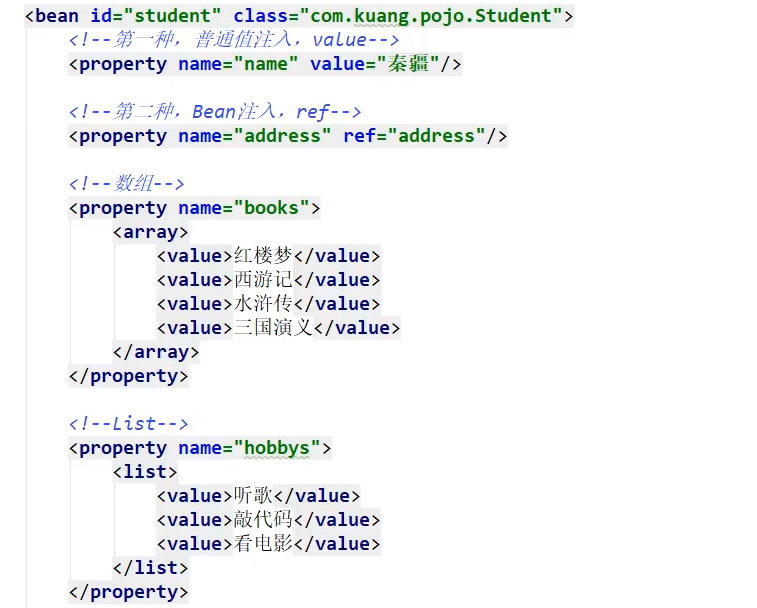

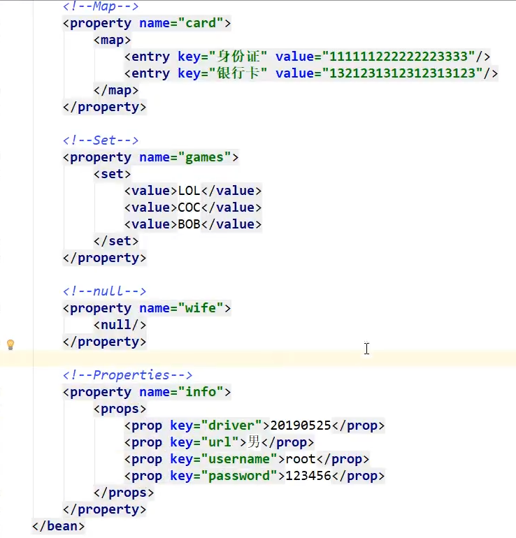

3.扩展方式注入

P命名；C命名

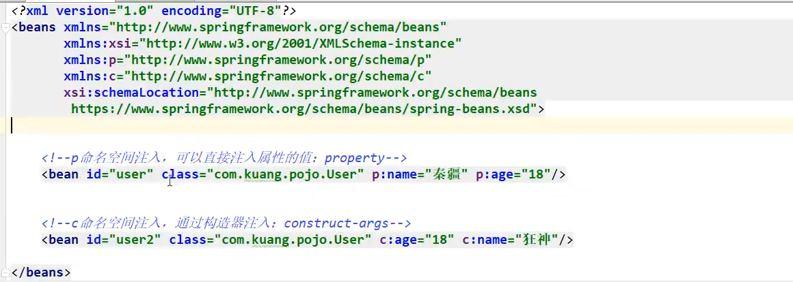

测试使用

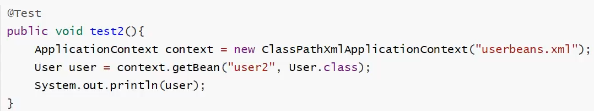

注意点：p命名和c命名不能直接使用，需要导入xml约束

## Bean的作用域

1.单例模式（Spring默认机制）

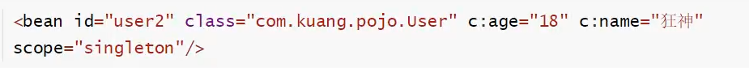

2.原型模式：每次从容器中get的时候，都会产生一个新对象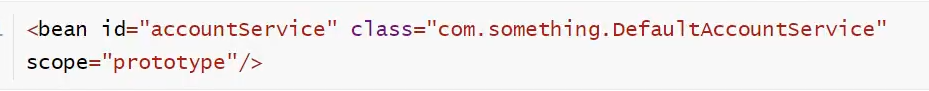

3.其余的request,session,application,这些只能在web开发中使用到

## Bean的自动装配

* 自动装配是Spring满足bean依赖一种方式

* Spring会在上下文中自动寻找，并自动给bean装配属性

在Spring中有三种装配的方式

* 在xml中显示的配置
* 在java中显示配置
* 隐式的自动装配bean

1.ByName自动装配

## 在xml中显示配置

### 搭建环境

Dog:

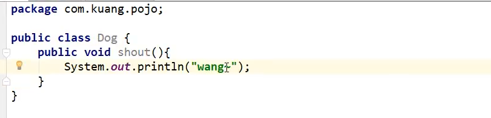

Cat:


People

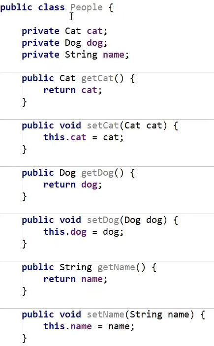

测试：

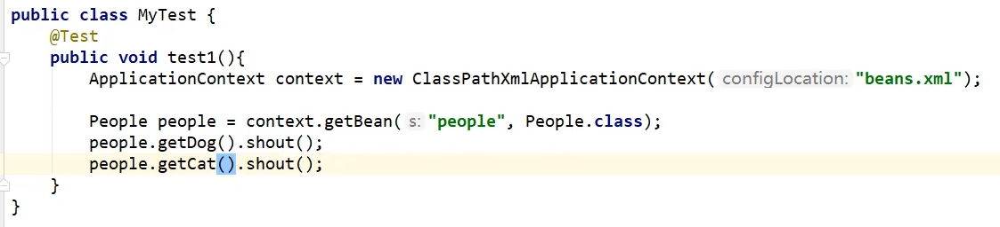

### ByName和ByType自动装配

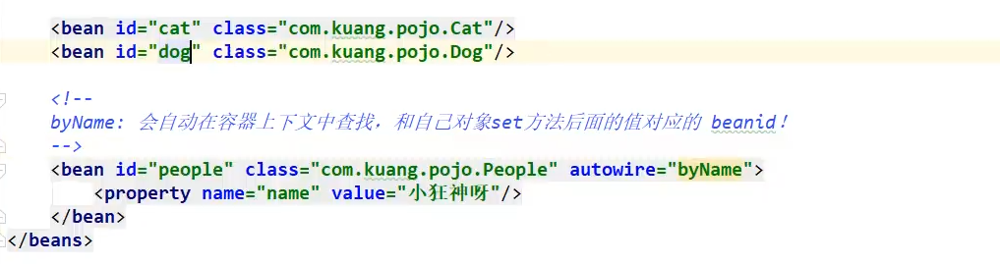

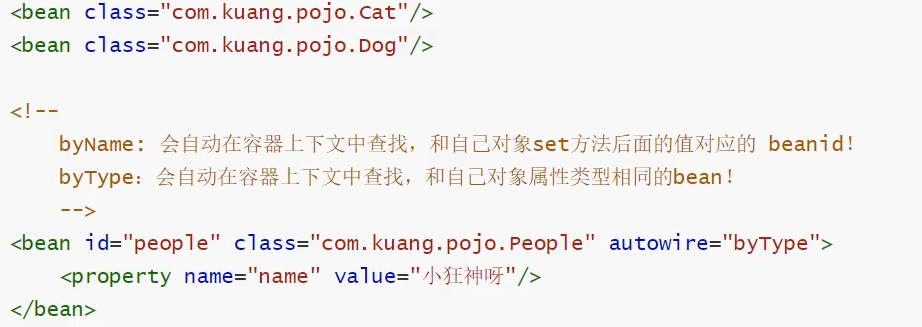

小结：

* ByName需要保证所有的bean的id唯一,并且这个bean需要和自动注入的属性的set方法的值一致
* ByName需要保证所有的bean的class唯一,并且这个bean需要和自动注入的属性的类型一致

## 使用注解自动装配

jdk1.5支持的注解；Spring2.5就支持注解

要使用注解须知

1.导入约束:context约束

2.配置注解的支持：context：annotation-config/

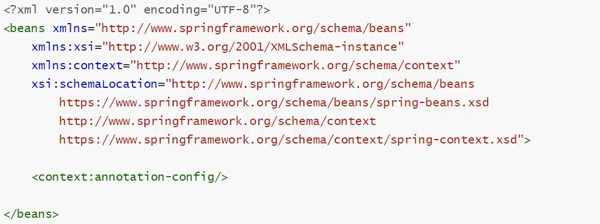

@Autowired;直接在属性上使用，也可以在set方式上使用

使用Autowired我们可以不用编写在Set方法了，前提是你这个自动装配的属性在IOC（Spring）容器中存在，且符合名字byname

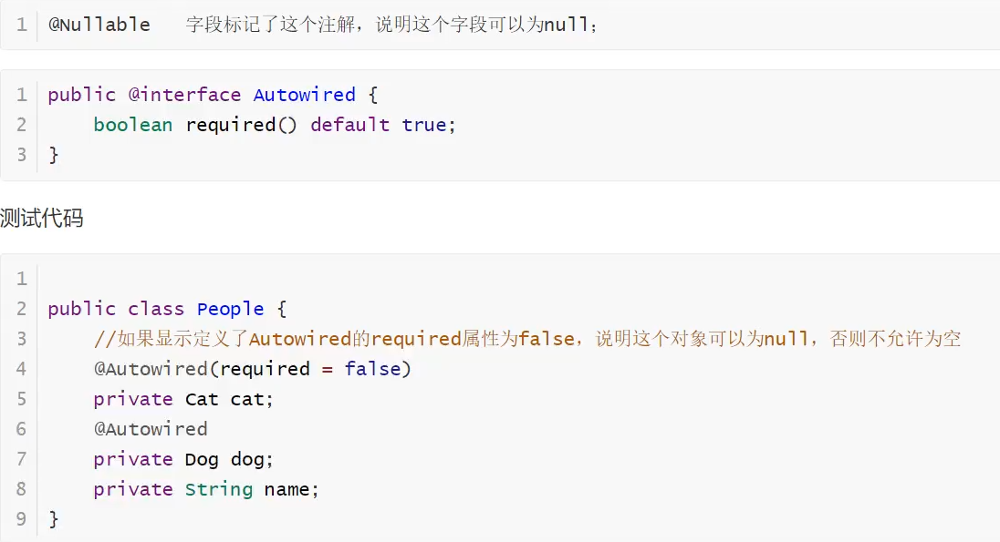

如果@Autowired自动装配的环境比较复杂，自动装配无法通过一个注解@Autowired完成的时候，我们可以使用@qualifier(value="XXX")去配置@Autowired的使用，指定一个唯一的bean对象注入

@Resource

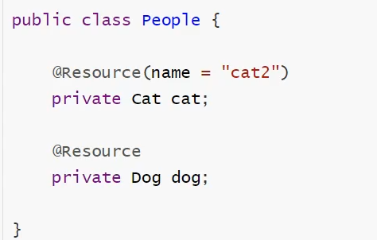


小结：@Resource和@Autowired的区别

* 都是用来自动装配的，都可以放在属性字段上
* @Autowired先通过byType的方式实现，如果找不到Type，则通过byName实现。而且必须要求这个对象存在(常用)。如果Autowired不能卫衣自动装配上属性，则需要通过@qualifier的类型指定value去查找name
* @Resource先通过byname的方式实现，如果找不到名字，则通过byType实现！如果两个都找不到的情况下，就报错！

* 执行顺序不同：@Autowired通过byType的方式实现，@Resource默认通过byname的方式实现

## 使用注解开发

@Component:组件，放在类上，说明这个类被Spring管理了，就是bean

<bean id="user" class="com.kuang.pojo.User">

@value:属性的注入

1.bean

 在Spring4之后，要使用注解开发，必须要保证aop的包导入了

使用注解需要导入context约束，增加注解的支持

2.属性如何注入

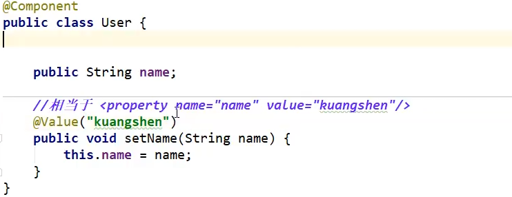

3.衍生的注解

@Component有几个衍生注解，我们在web开发中，会按照mvc三层架构分层!

* dao :@Repository
* servicer:@Service
* controller:@Controller

这四个注解功能都是一样的，都是代表将某个类注册到Spring中，装配Bean

4.自动装配配置

5.作用域

6.小结

xml与注解：

* xml更加万能，适用于任何场合，维护更加简单方便
* 注解不是自己类使用不了，维护相对复杂

xml与注解最佳实践：

* xml用来管理bean
* 直接只负责完成属性的注入
* 我们在使用的过程中，只需要一个问题，必须让注解生效，就需要开启注解的支持，指定需要扫描的包

## 使用Java的方式配置Spring

我们现在要完全不使用Spring的xml配置，全权交给Java使用

JavaConfig是Spring的一个子项目，在Spring4之后，它成为了一个核心功能

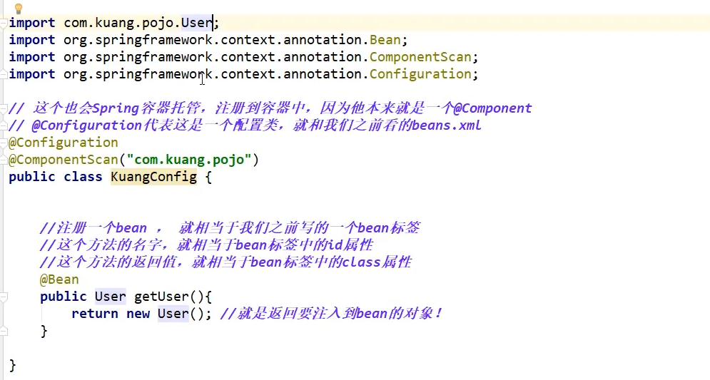

测试时候：

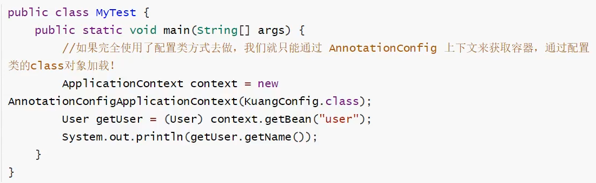


### 代理模式（SpringAOP的底层）

代理模式的分类：动态和静态代理

### 静态代理

* 抽象角色一般会使用接口或者抽象类来解决
* 真实角色：被代理的角色
* 代理角色：代理真实角色，代理真实角色后，我们一般会做一些附属操作
* 客户：访问代理对象的人！

代理模式的好处

* 可以使真实角色的操作更加纯粹，不用去关注公共的业务
* 公共也就交给代理角色，实现了业务的分工
* 公共业务发生扩展的时候，方便集中管理！
* 一个动态代理类处理的是一个借口，一般就是对应的一类业务
* 一个动态代理类可以代理多个类，只要是实现了同一个接口

缺点

* 一个真实角色就会产生一个代理角色，代码量会翻倍，开发效率会变低

代码步骤：

1.接口

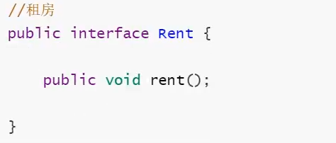

2.真实角色

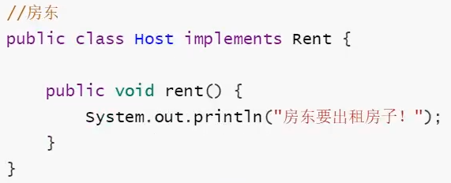

3.代理角色

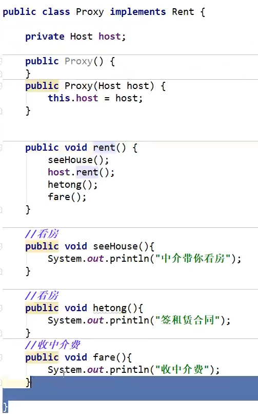


4.客户端访问代理角色

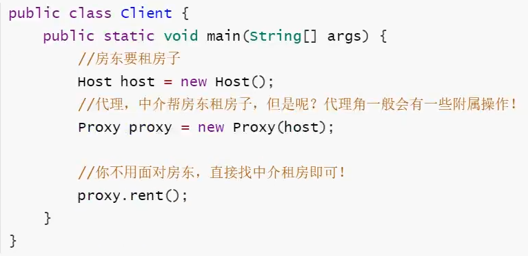

AOP横向开发机制

### 动态代理

动态代理和静态代理角色一样

动态代理的代理类是动态生成的，不是我们直接写好的！

动态代理分为两大类：基于接口的动态代理，给予类的动态代理

* 基于接口-JDK动态代理
* 基于类-cglib
* java字节码实现：javasist

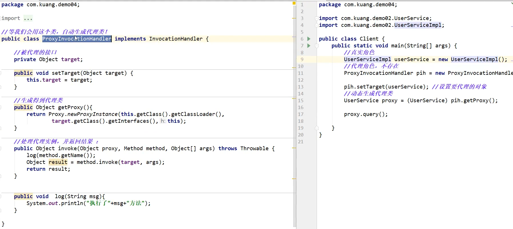

## AOP（面向切面编程）

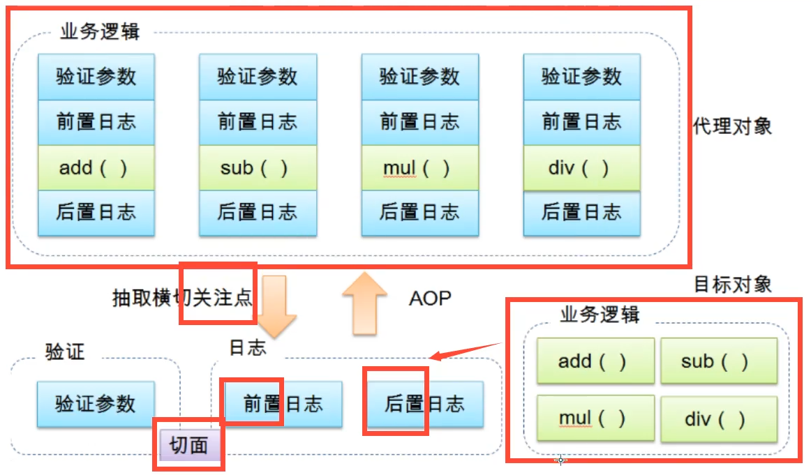

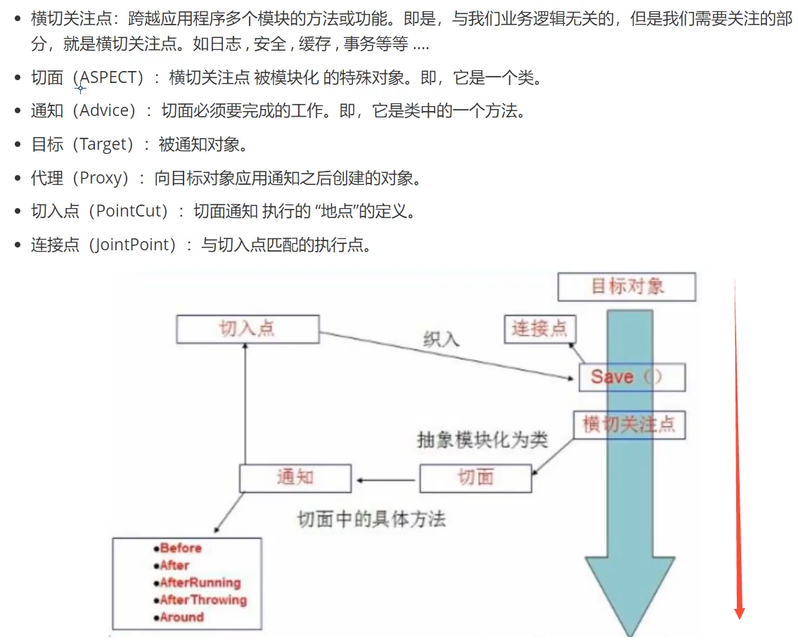

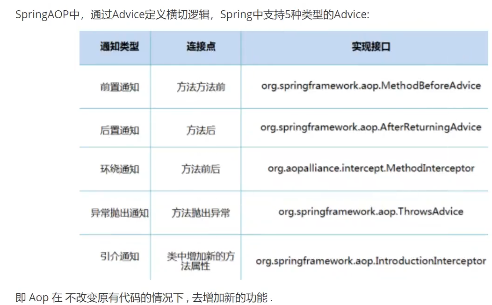

### 方式1 使用Spring的API接口实现

日志：

前置日志

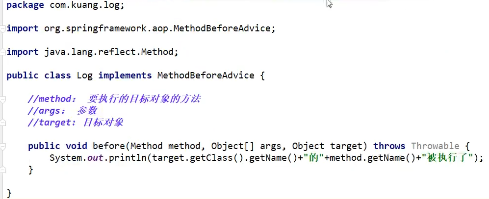

后置日志

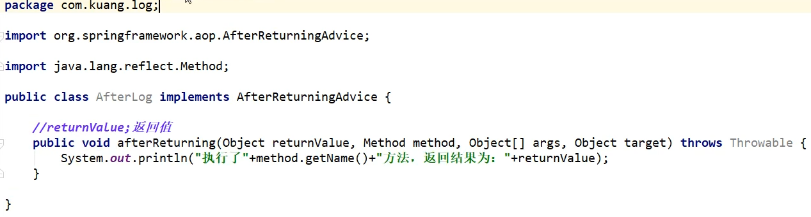

service和serviceImpl

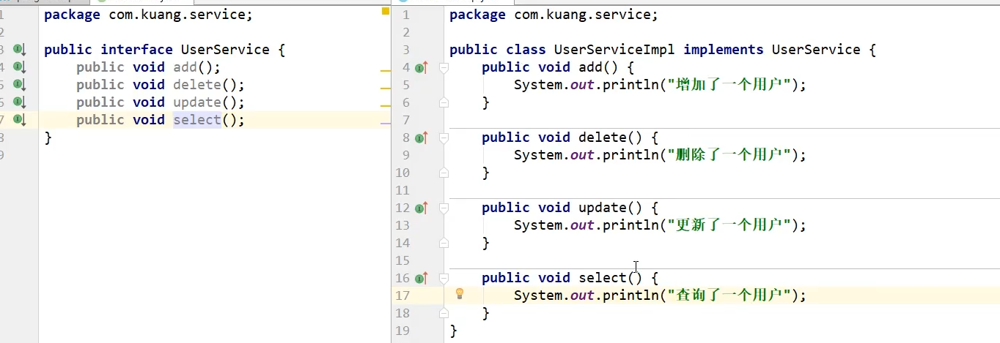

xml配置

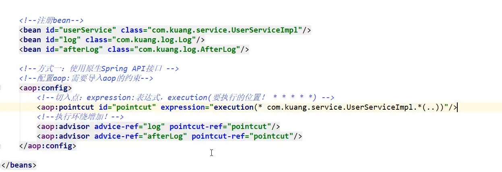

测试：

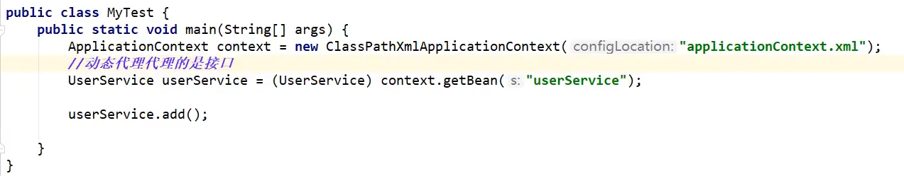

### 方式二：自定义来实现AOP【主要是切面定义】

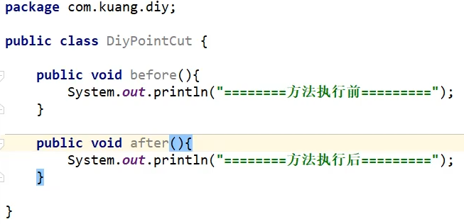

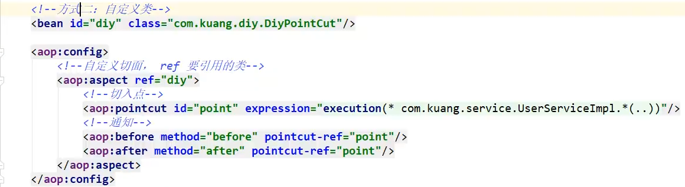

## 方式三：使用注解来配置

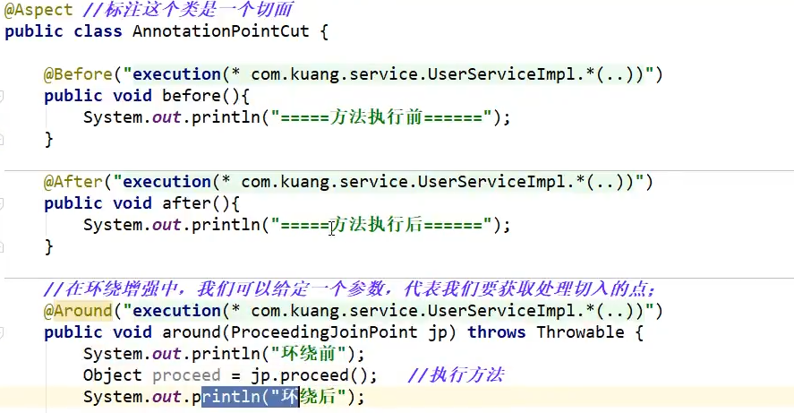

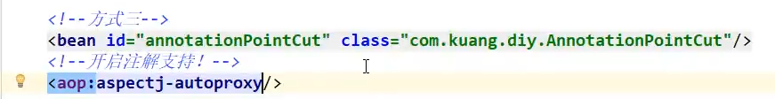

最终测试结果

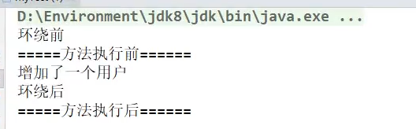

## 整合mybatis

方式一：

1.导入jar包

mybatis-Spring,mybatis-SpringBoot

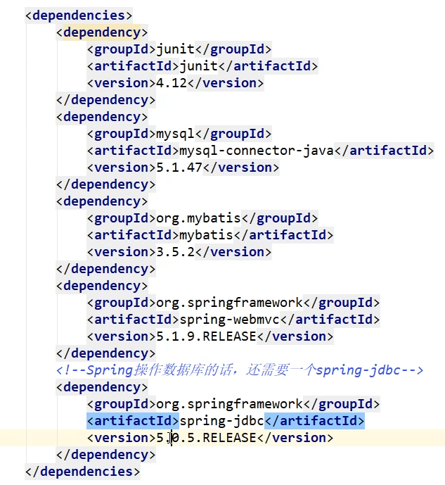

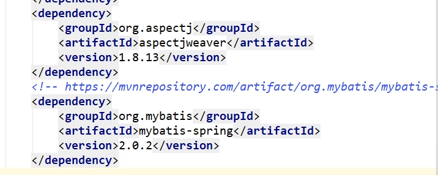

2.编写配置文件

mybatis-config.xml

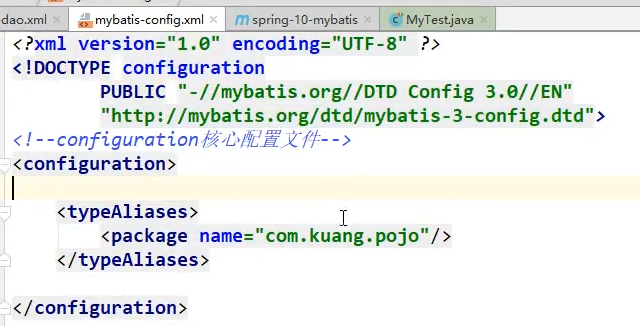

spring-dao.xml

要和Spring一起使用MyBatis，需要在Spring应用上下文中定义两样东西，要配置这个工厂bean,只需要把下面代码放在Spring

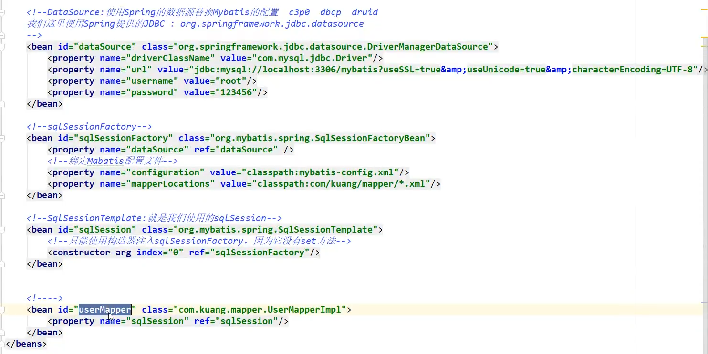

UserMapperImpl.xml

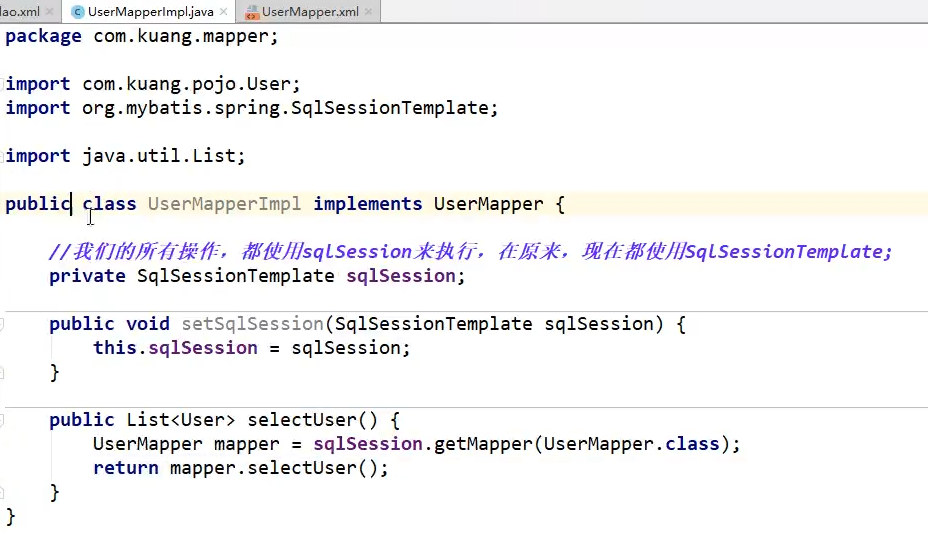

测试

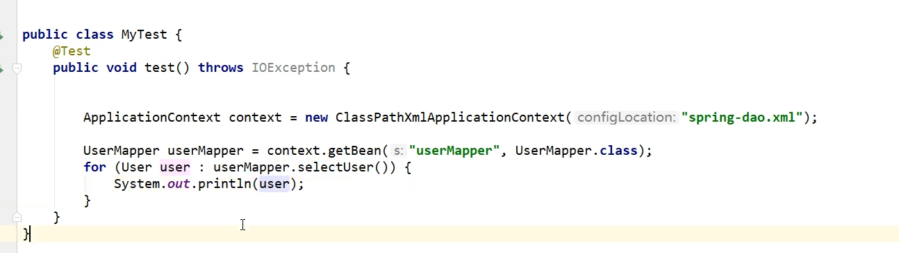

方式2-了解即可：

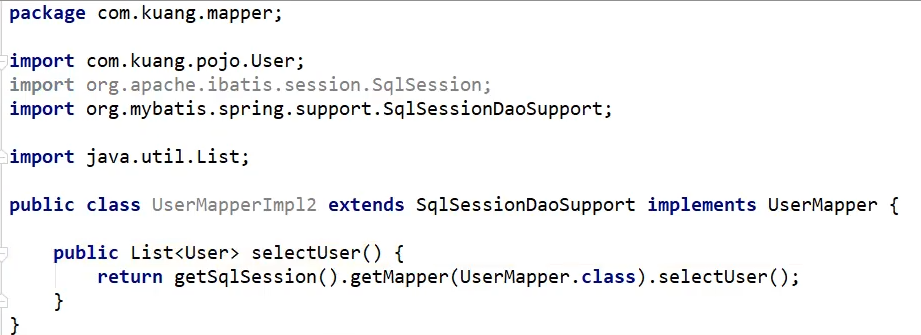

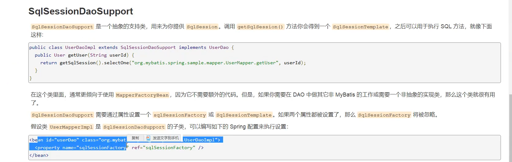

声明式事务（ACID原则）：确保完整性和一致性

* 原子性

* 一致性

* 隔离性：多个业务可能操作同一个资源，防止数据损失

* 持久性

事务一旦提交，无论系统发生什么问题，结果都不会再被影响，被持久化的写到存储器中

## Spring中的事务管理

* 声明式事务：AOP
* 编程式事务：需要在代码中，进行代码管理

思考：为什么需要使用事务？

* 如果不配置事务，可能存在数据提交不一致的情况
* 如果我们不在Spring中去配置声明式事务，我们就需要在代码中手动配置事务
* 事务在项目中的开发中十分重要，涉及到数据的完整性和一致性

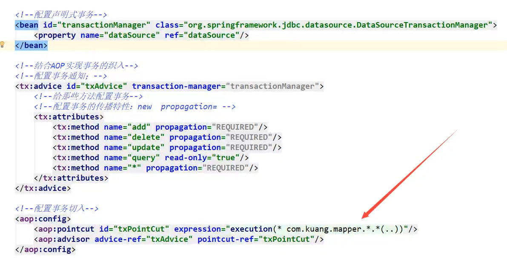

Spring事务管理详细介绍：

https://blog.csdn.net/donggua3694857/article/details/69858827?utm_medium=distribute.pc_relevant.none-task-blog-2%7Edefault%7EBlogCommendFromMachineLearnPai2%7Edefault-2.vipsorttest&depth_1-utm_source=distribute.pc_relevant.none-task-blog-2%7Edefault%7EBlogCommendFromMachineLearnPai2%7Edefault-2.vipsorttest


