## SpringCloud

一、什么是微服务

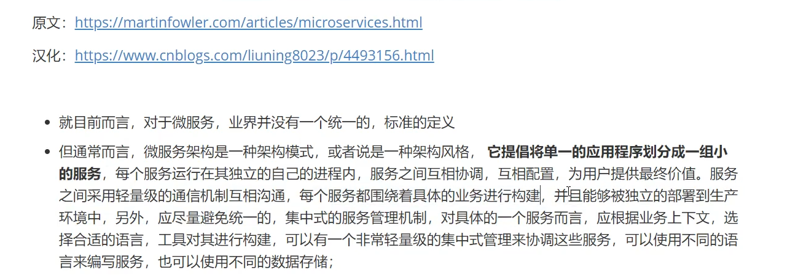

二、微服务和微服务架构区别

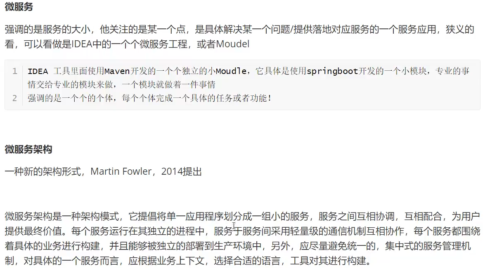

三、微服务优缺点

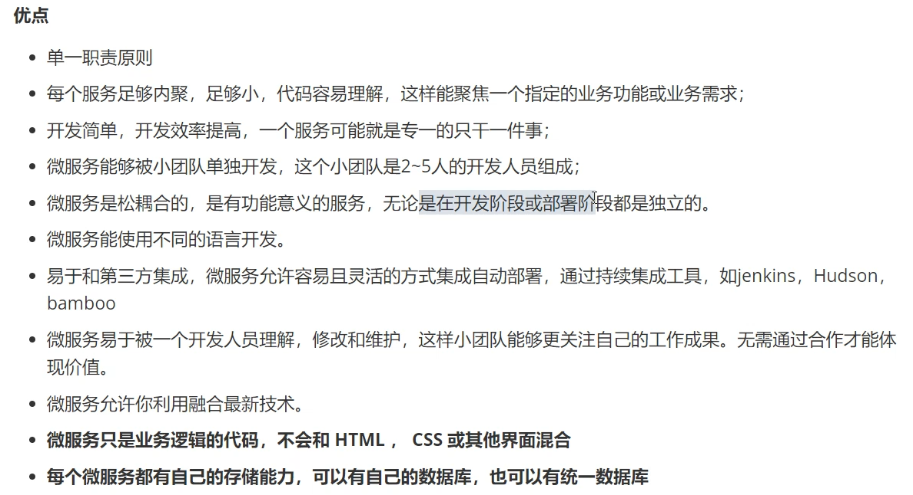

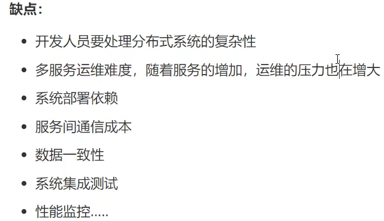

四、微服务技术栈

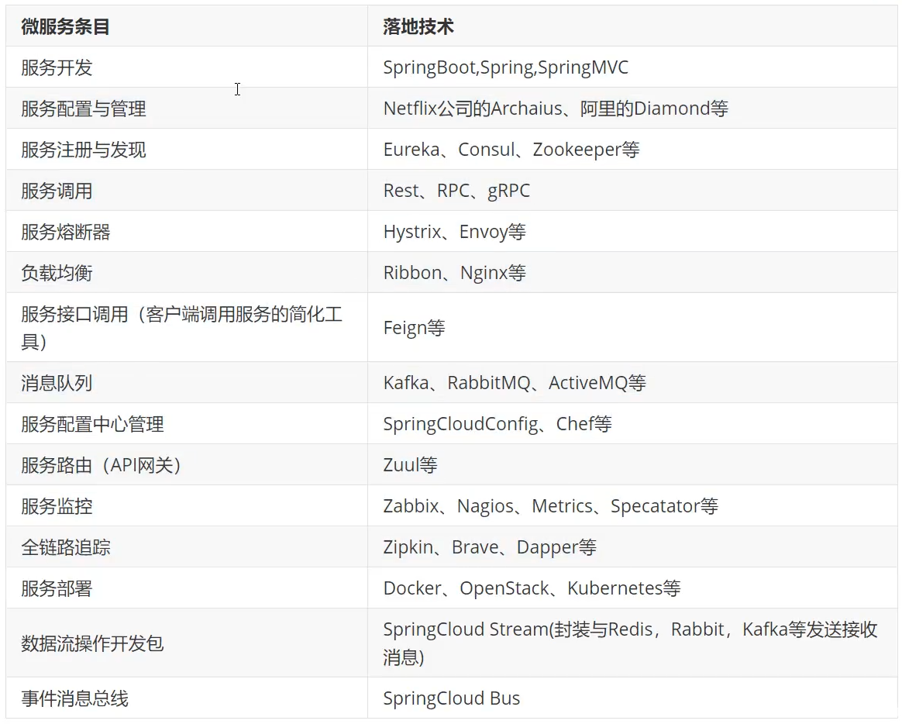

五、SpringCloud入门

5.1 SpringCloud介绍

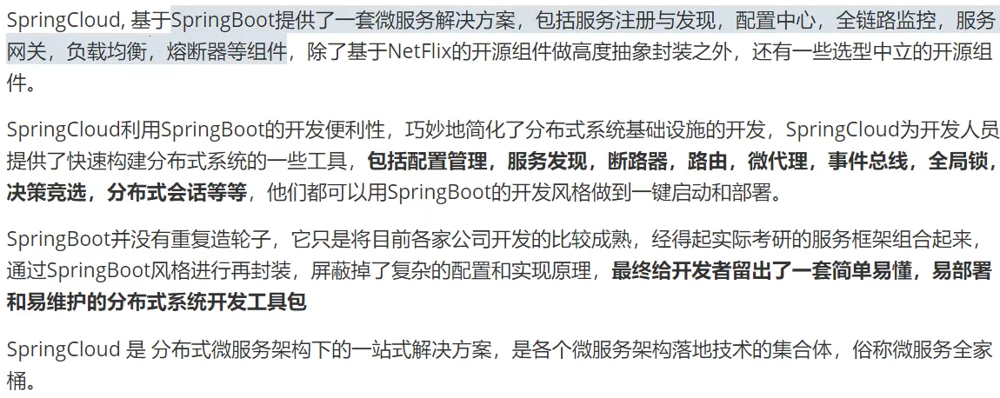

5.2 SpringBoot和SpringCloud关系

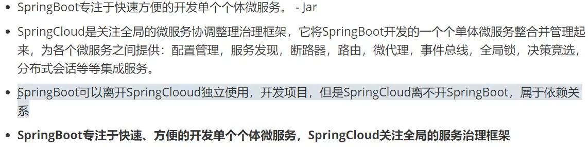


5. 4 负载均衡（Feign/Ribbon）

### 为什么需要负载均衡

为了提供并发量，有时同一个服务提供者可以部署多个。这个客户端在调用时要根据一定的负责均衡策略完成负载调用。

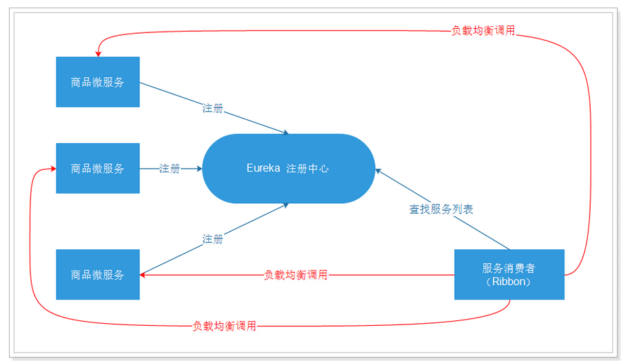

```
https://www.jianshu.com/p/df98972d28f0
```


Feign是一个声明式的Web Service客户端，它的目的就是让Web  Service调用更加简单。Feign提供了HTTP请求的模板，通过编写简单的接口和插入注解，就可以定义好HTTP请求的参数、格式、地址等信息。而Feign则会完全代理HTTP请求，我们只需要像调用方法一样调用它就可以完成服务请求及相关处理。Feign整合了Ribbon和Hystrix(关于Hystrix我们后面再讲)，可以让我们不再需要显式地使用这两个组件。

Feign是以接口方式进行调用,而不是通过RestTemplate来调用,feign底层还是ribbo,它进行了封装,让我们调用起来更加happy.

## Feign原理简述

- 启动时，程序会进行包扫描，扫描所有包下所有@FeignClient注解的类，并将这些类注入到spring的IOC容器中。当定义的Feign中的接口被调用时，通过JDK的动态代理来生成RequestTemplate。
- RequestTemplate中包含请求的所有信息，如请求参数，请求URL等。
- RequestTemplate声场Request，然后将Request交给client处理，这个client默认是JDK的HTTPUrlConnection，也可以是OKhttp、Apache的HTTPClient等。
- 最后client封装成LoadBaLanceClient，结合ribbon负载均衡地发起调用。

5. 5注册中心和服务中心（Eureka）

  Eureka是netflix的一个子模块，也是核心模块之一，Eureka是一个基于REST的服务，用于定位服务，以实现云端中间层服务发现和故障转移。服务注册与发现对于微服务架构来说是非常重要的，有了服务发现和注册，只需要使用服务的标识符，就可以访问到服务，而不需要修改服务，而不需要修改服务调用的配置文件了，功能类似于dubbo的注册中心，比如zookeeper。 

5. 6 Dubbo和SpringCloud技术选型

1.分布式+服务治理Dubbo

目前成熟的互联网架构：应用服务化拆分+消息中间件

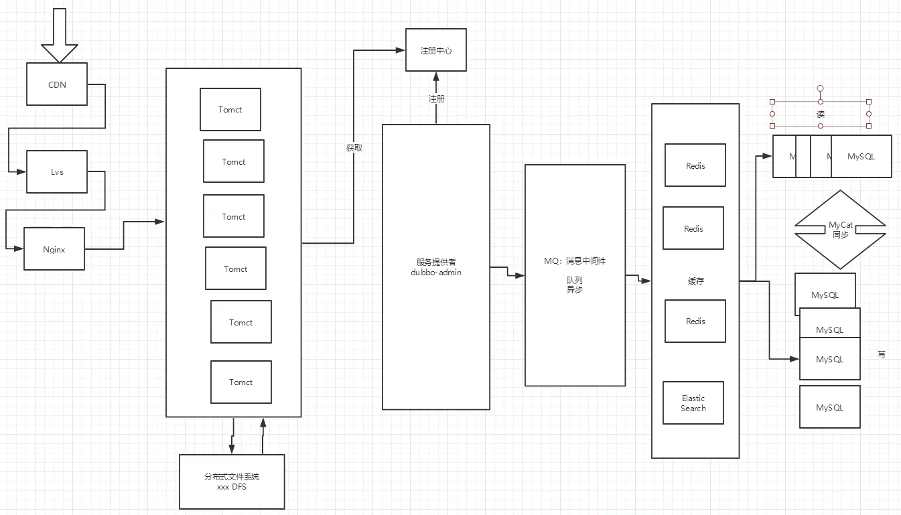


Dubbo和SpringCloud对比

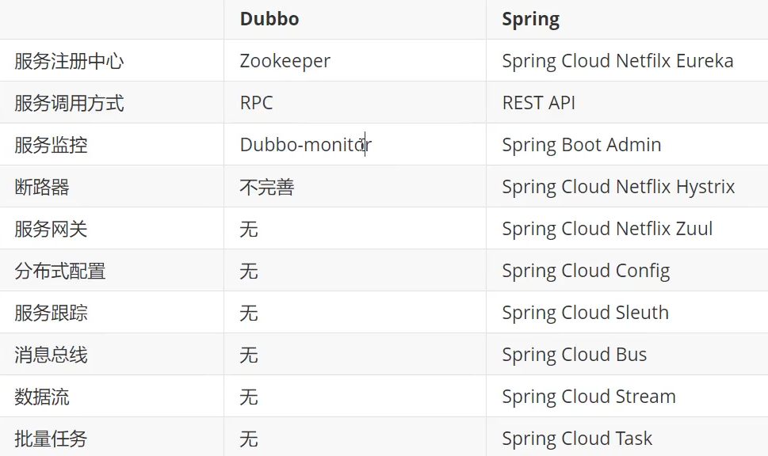

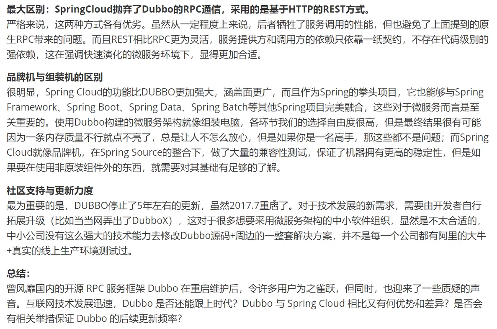

Eureka:服务注册与发现

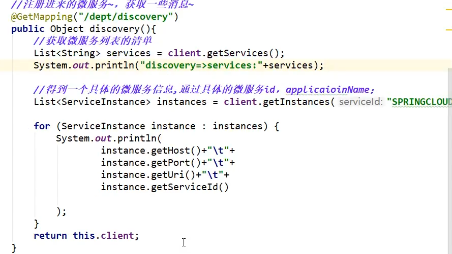

消费者

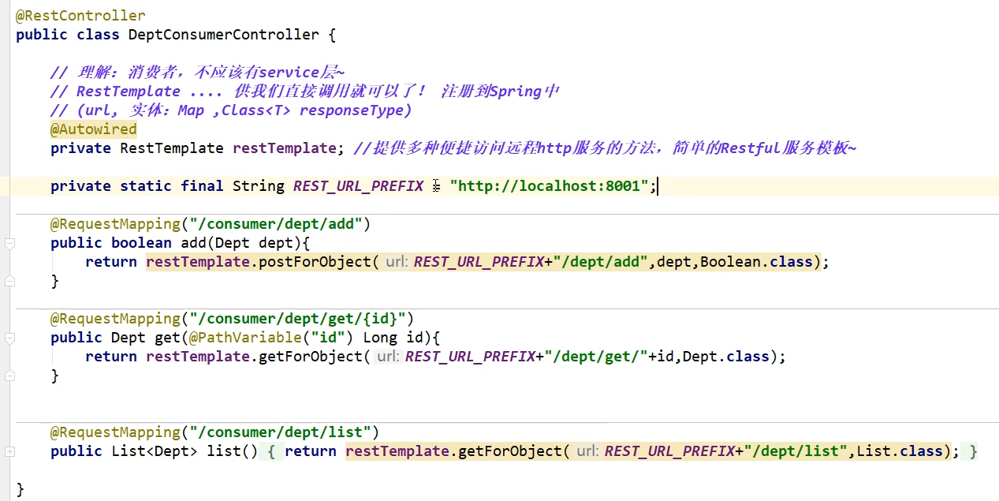

Eureka和ZooKeeper

### cap原则

RDBMS(Mysql,Oracle、sqlSever)-ACID

NoSQL(redis、mongdb)-CAP

AICD是什么？

- A（Atomicity）原子性
- C（consistency）一致性
- I（Isolation）隔离性
- D（Durability）持久性

CAP是什么

- C（Consistency）强一致性
- A（Availability）可用性
- P（Partition tolerance）分区容错性

CAP理论：一个分布式系统不可能同事满足C\A\P，由于分区容错性P是在分布系统中是必须要保证的，因此只能在A和C之间进行权衡

Zookeeper保证的是CP

Eurake保证的是AP

**因此，Eurake可以很好的应对因网络故障导致部分节点失去联系的情况，而不会像zookeeper那样使整个注册服务瘫痪**

## ribbon

Ribbon是Netflix发布的开源项目，主要功能是提供客户端的软件负载均衡算法，将Netflix的中间层服务连接在一起。Ribbon客户端组件提供一系列完善的配置项如连接超时，重试等。简单的说，就是在配置文件中列出Load Balancer后面所有的机器，Ribbon会自动的帮助你基于某种规则（如简单轮询，随即连接等）去连接这些机器。我们也很容易使用Ribbon实现自定义的负载均衡算法。

## 负载均衡

### 分类

1. 服务器端负载均衡：例如Nginx，通过Nginx进行负载均衡，先发送请求，然后通过负载均衡算法，在多个服务器之间选择一个进行访问；即在服务器端再进行负载均衡算法分配。

2. 客户端负载均衡：例如spring cloud中的ribbon，客户端会有一个服务器地址列表，在发送请求前通过负载均衡算法选择一个服务器，然后进行访问，这是客户端负载均衡；即在客户端就进行负载均衡算法分配。

### Ribbon是什么？

Ribbon是Netflix发布的开源项目，主要功能是提供**客户端**的软件负载均衡算法，将Netflix的中间层服务连接在一起。Ribbon客户端组件提供一系列完善的配置项如连接超时，重试等。简单的说，就是在配置文件中列出**Load Balancer**后面（简称LB：负载均衡）所有的机器，Ribbon会自动的帮助你基于某种规则（如简单轮询，随即连接等）去连接这些机器。我们也很容易使用Ribbon实现自定义的负载均衡算法。

### ribbon能干嘛

- LB，在微服务或者分布式集群中经常用的一种应用
- 负载均衡简单地来说就是将用户的请求平摊的分配到多个服务商，从而达到系统的HA（高可用）

### 负载均衡简单分类

第一类：集中式负载均衡, 

**即在服务的消费方** 和 提供方之间使用独立的负载均衡设施(如 nginx  反向代理服务器), 由该设施负责把访问请求通过某种策略转发至 服务的提供方；

第二类：进程式负载均衡，

将负载均衡逻辑集成到 消费方，消费方从**服务注册中心**获知有哪些地址可用，然后自己再从这些地址中选择出一个合适的 服务器。

Ribbon就属于进程式LB，他只是一个类库，集成于消费方进程，消费方通过它来获取到服务提供方的地址

### 实践

1.消费方导包

2.配置文件

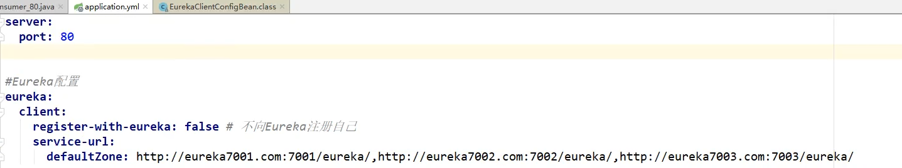

在主启动类下面加入注解@EnableEurakeClient

Ribbon和Eurake整合以后，客户端可以直接调用，不用关心IP地址和端口号


3.ConfigBean

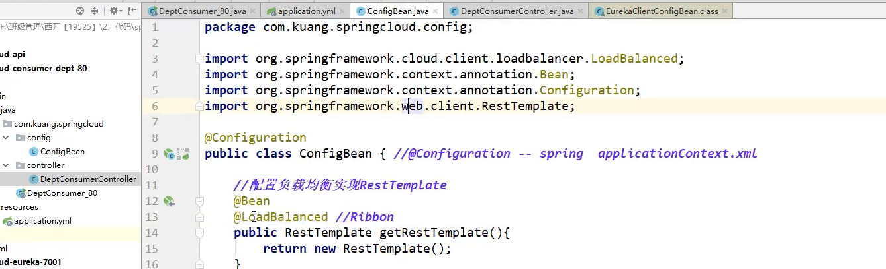

4.Controller

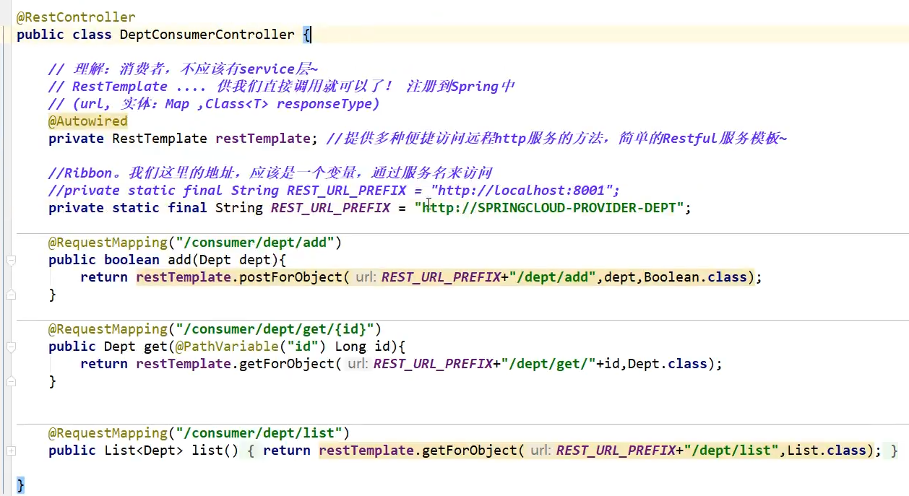

### 负载均衡算法

IRule

- RoundRobinRule 轮询
- RandomRule 随机
- AvailabilityFilteringRule:会先过滤掉，跳闸，访问故障的服务，对剩下的进行轮询
- RetryRule: 会先按照轮询获取服务~~，如果服务获取失败，则会在指定的时间内进行，重试

自定义算法

实践

1.在主启动类

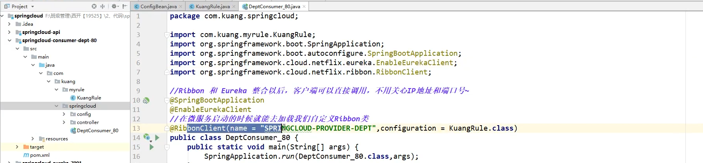

自定义的Rule配置类

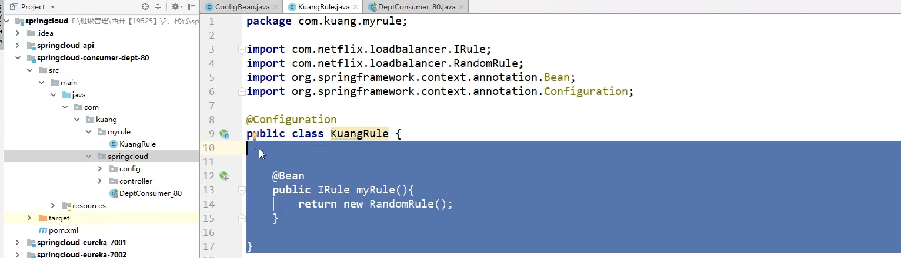

Feign负载均衡

feign是声明式的web service客户端，它让微服务之间的调用变得更简单了，类似controller调用service.Spring Cloud集成了Ribbon和Eureke,可在使用Feign时提供负载均衡的http客户端

Feign的作用

- Feign目的使Ribbon+RestTemplate时，利用RestTemplate对http请求的封装处理，形成了一套模板化的调用方法。但是在实际开发中，由于对服务依赖的调用可能不止一处，往往一个接口会被多处调用，所以通常都会针对每个微服务自行封装一些客户端来包装这些依赖服务的调用。所以，Feign在此基础上做了进一步封装，由他来帮助我们定义和实现依赖服务接口的定义
- 在Feign的实现下，我们只需要创建一个接口并使用注解的方式来配置它（类似于以前Dao接口标注Mapper,现在是一个微服务接口上面标注一个Feign注解）
- 完成对服务提供方的接口绑定，简化了使用Spring Cloud Ribbon时，自动封装服务调用客户端的开发量

Feign集成了Ribbon

- 利用了Ribbon维护了服务列表信息，并且通过轮询实现了客户端的负载均衡，而与Ribbon不同的是，通过Feign只需要定义服务绑定接口且以声明式的方法，优雅而简单的实现了服务调用

实践

1.自定义接口

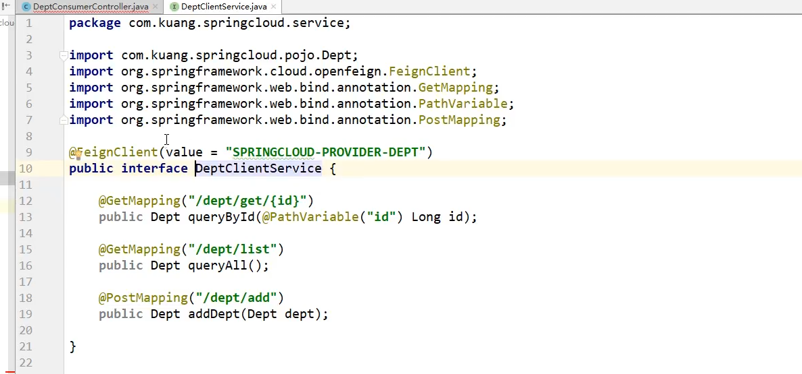

2.Controller

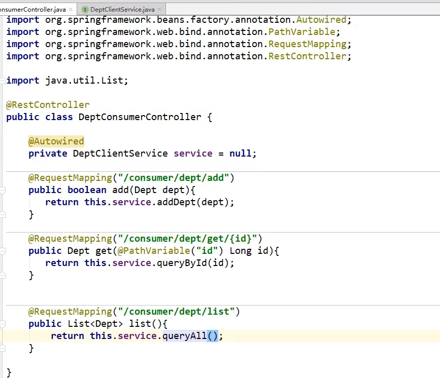

3.主启动类

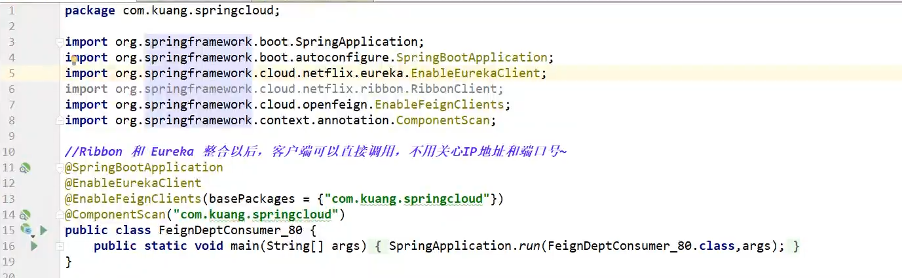

## 熔断器Hystrix

```
http://www.ityouknow.com/springcloud/2017/05/16/springcloud-hystrix.html
```

### 雪崩效应

 在微服务架构中通常会有多个服务层调用，基础服务的故障可能会导致级联故障，进而造成整个系统不可用的情况，这种现象被称为服务雪崩效应。服务雪崩效应是一种因“服务提供者”的不可用导致“服务消费者”的不可用,并将不可用逐渐放大的过程。 

什么是Hystrix

Hystrix是一个用于处理分布式系统的延迟和容错的开源库，在分布式系统里面，许多依赖不可避免的会调用失败，比如超时，异常等；Hytrix能否保证在一个依赖出问题的情况下，不会导致整体服务失败，避免级联故障，以提高分布式系统的弹性。

断路器向服务调用方返回一个服务预期的，可处理的备选响应，而不是长时间的等待或者抛出调用方法无法处理的异常，这样就可以保证了服务调用方的线程不会被长时间，不必要的占用，从而避免了故障在分布式系统中的蔓延

作用

服务降级

服务熔断

服务限流

接近实时的监控

### 服务熔断

是什么

服务熔断是赌赢雪崩效应的一种微服务链路保护机制 

当扇出链路的某个微服务不可用或者响应时间太长时，会进行服务的降级，进而熔断该节点微服务的调用，快速返回错误的响应信息。当检测到该节点微服务调用响应正常后回复调用链路、在SpringCloud框架里熔断机制通过Hytrix实现、Hytrix会监控微服务间调用的状况，当失败的调用到一定阈值，缺省是5秒内20次调用失败就会启动熔断机制，熔断机制的注解是**@HystrixCommmand**

实践

导入依赖Spring-Cloud-Hytrix

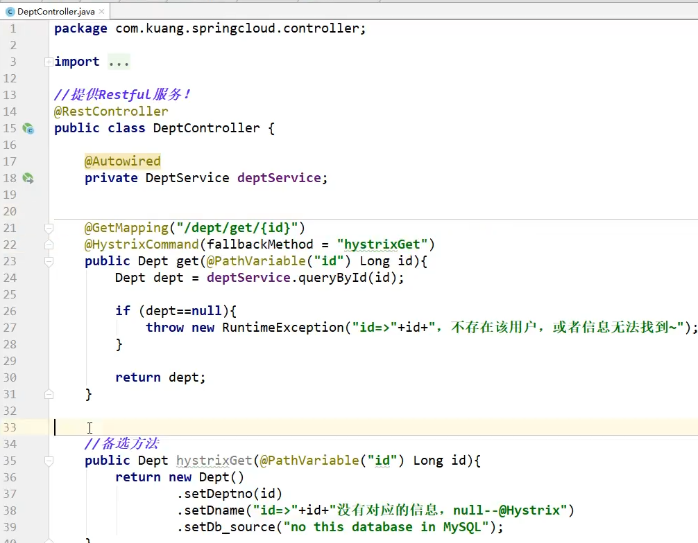

在主启动类上面添加对熔断的支持@EnableCircuitBreaker（断路器）

### 服务降级

Fallback相当于是降级操作. 对于查询操作, 我们可以实现一个fallback方法, 当请求后端服务出现异常的时候, 可以使用fallback方法返回的值. fallback方法的返回值一般是设置的默认值或者来自缓存.

总结：

**服务熔断是在服务端设置；**某个服务超时或者异常，引起熔断，类似保险丝

**服务降级是在客户端设置**，从整体网站请求负载考虑，当某个服务熔断或者关闭之后，服务将不再被调用，此时在客户端准备一个FallbackFactory,返回一直默认值（缺省值），整体的服务水平下降了，好歹能用

### DashBoard流监控（break dashboard）

1.消费端导包，配置端口，开启监控@EnableHystrixDashboard//开启

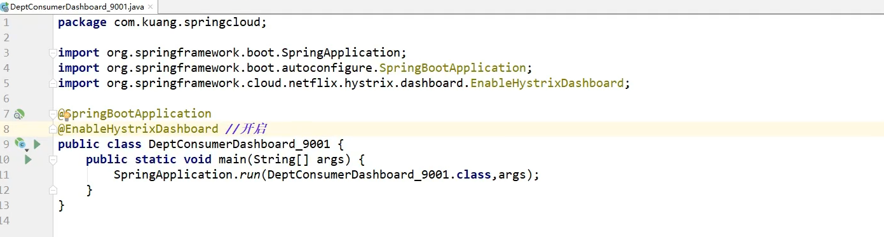

2.服务端完善监控信息，导包（spring-boot-starter-actuator）

在启动类上面加入一个Servlet

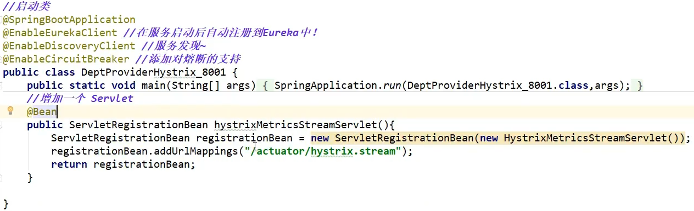

## Zuul路由网关

Zuul包含了对请求的路由和过滤两个最主要的功能

其中路由功能负责将外部请求转发到具体的微服务实例上，是实现外部访问统一入口的基础，而过滤器功能则负责对请求的处理过程进行干预，是实现请求检验，服务聚合等功能的基础。Zuul和Eurake进行整合，将Zuul自身注册为Eureka服务治理下的应用，同时从Eureka中获得其他微服务的消息，也以后的访问微服务都是通过Zuul跳转后获得

提供：代理+路由+过滤

实践

1.编写配置文件

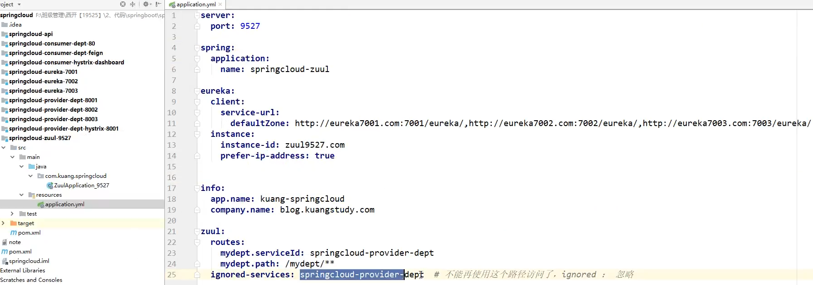

主启动类下面开启注解@EnableZuulProxy

SpringCloud config分布式配置

分布式系统面临的配置文件的问题

由于每个服务都需要必要的配置信息才能运行，所以一套集中式，动态的配置管理设施是必不可少的。SpringCloud提供了ConfigSever来解决问题。

SpringCloud Config为微服务架构中的微服务提供集中化的外部配置支持，配置服务器为各个不同微服务应用的所有环节提供了一个中心化的外部配置。

SpringCloud Config分为**服务端**和**客户端**两部分

服务端称为分布式配置中心，它是一个独立的**微服务应用**，用来连接配置服务器并未客户端提供获取配置信息，加密，解密信息等访问接口

客户端则是通过指定的配置中心来管理应用资源，以及与业务相关的配置内容，并在启动的时候从配置中心获取和加载配置信息。配置服务器默认采用git来存储配置信息，这样就有助于对环境配置进行版本管理。并且可以通过git客户端工具来方便的管理和访问配置内容。

SpringCloud Config的作用

- 集中管理配置文件

- 不同环境，不同配置，动态化的配置更新，分环境部署
- 运行期间动态调整配置，不再需要在每个服务部署的机器上编写配置文件，服务会向配置中心统一拉取配置自己的信息
- 将配置信息以REST接口的形式暴露


### 熔断器（CircuitBreaker）

 熔断器的原理很简单，如同电力过载保护器。它可以实现快速失败，如果它在一段时间内侦测到许多类似的错误，会强迫其以后的多个调用快速失败，不再访问远程服务器，从而防止应用程序不断地尝试执行可能会失败的操作，使得应用程序继续执行而不用等待修正错误，或者浪费CPU时间去等到长时间的超时产生。熔断器也可以使应用程序能够诊断错误是否已经修正，如果已经修正，应用程序会再次尝试调用操作。  熔断器就是保护服务高可用的最后一道防线。 

### Hystrix特性

**1.断路器机制**

断路器很好理解, 当Hystrix Command请求后端服务失败数量超过一定比例(默认50%), 断路器会切换到开路状态(Open).  这时所有请求会直接失败而不会发送到后端服务. 断路器保持在开路状态一段时间后(默认5秒), 自动切换到半开路状态(HALF-OPEN).  这时会判断下一次请求的返回情况, 如果请求成功, 断路器切回闭路状态(CLOSED), 否则重新切换到开路状态(OPEN).  Hystrix的断路器就像我们家庭电路中的保险丝, 一旦后端服务不可用, 断路器会直接切断请求链, 避免发送大量无效请求影响系统吞吐量,  并且断路器有自我检测并恢复的能力.

**2.Fallback**

Fallback相当于是降级操作. 对于查询操作, 我们可以实现一个fallback方法, 当请求后端服务出现异常的时候, 可以使用fallback方法返回的值. fallback方法的返回值一般是设置的默认值或者来自缓存.

**3.资源隔离**

在Hystrix中, 主要通过线程池来实现资源隔离. 通常在使用的时候我们会根据调用的远程服务划分出多个线程池.  例如调用产品服务的Command放入A线程池, 调用账户服务的Command放入B线程池. 这样做的主要优点是运行环境被隔离开了.  这样就算调用服务的代码存在bug或者由于其他原因导致自己所在线程池被耗尽时, 不会对系统的其他服务造成影响.  但是带来的代价就是维护多个线程池会对系统带来额外的性能开销. 如果是对性能有严格要求而且确信自己调用服务的客户端代码不会出问题的话,  可以使用Hystrix的信号模式(Semaphores)来隔离资源.

## Feign Hystrix

 因为熔断只是作用在服务调用这一端，因此我们根据上一篇的示例代码只需要改动spring-cloud-consumer项目相关代码就可以。因为，Feign中已经依赖了Hystrix所以在maven配置上不用做任何改动。 

### 1、配置文件

application.properties添加这一条：

```
feign.hystrix.enabled=true
```

### 2、创建回调类

创建HelloRemoteHystrix类继承与HelloRemote实现回调的方法

```
@Component
public class HelloRemoteHystrix implements HelloRemote{

    @Override
    public String hello(@RequestParam(value = "name") String name) {
        return "hello" +name+", this messge send failed ";
    }
}
```

### 3、添加fallback属性

在`HelloRemote`类添加指定fallback类，在服务熔断的时候返回fallback类中的内容。

```
@FeignClient(name= "spring-cloud-producer",fallback = HelloRemoteHystrix.class)
public interface HelloRemote {

    @RequestMapping(value = "/hello")
    public String hello(@RequestParam(value = "name") String name);

}
```

5. 


Nacos

 Nacos 配置原理：

```
https://blog.csdn.net/liuyan1234/article/details/106505869?utm_medium=distribute.pc_relevant.none-task-blog-2%7Edefault%7EBlogCommendFromBaidu%7Edefault-17.control&depth_1-utm_source=distribute.pc_relevant.none-task-blog-2%7Edefault%7EBlogCommendFromBaidu%7Edefault-17.control
```

什么是Nacos

官方是这么介绍的：Nacos 致力于帮助您发现、配置和管理微服务。Nacos 提供了一组简单易用的特性集，帮助您实现动态服务发现、服务配置管理、服务及流量管理。
 Nacos 帮助您更敏捷和容易地构建、交付和管理微服务平台。 Nacos 是构建以“服务”为中心的现代应用架构(例如微服务范式、云原生范式)的服务基础设施。

### Nginx


### Docker


